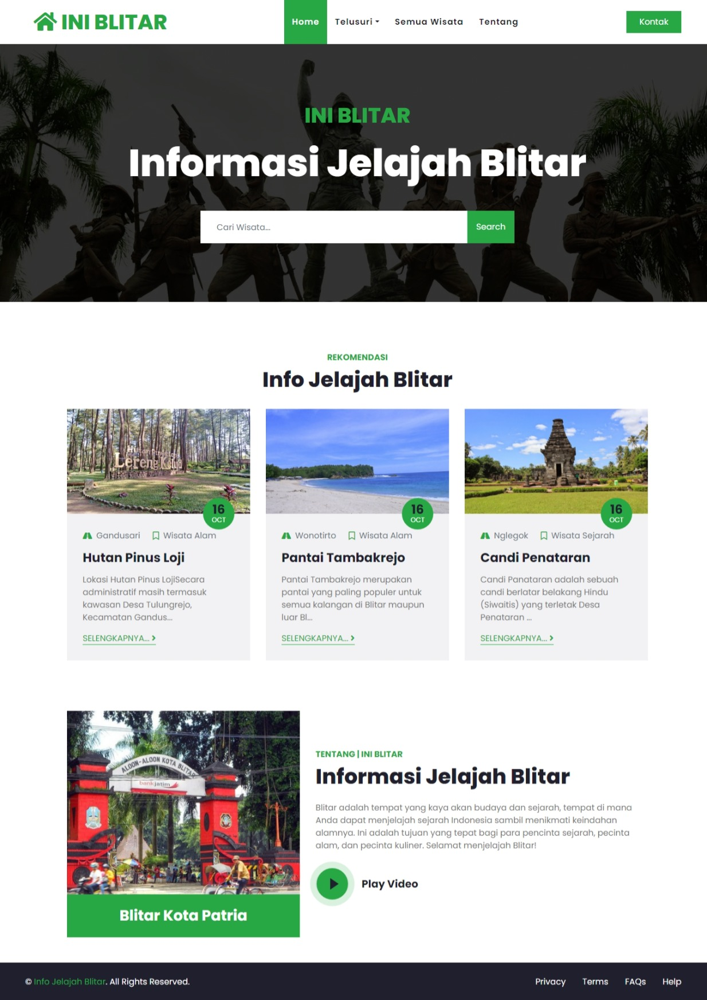
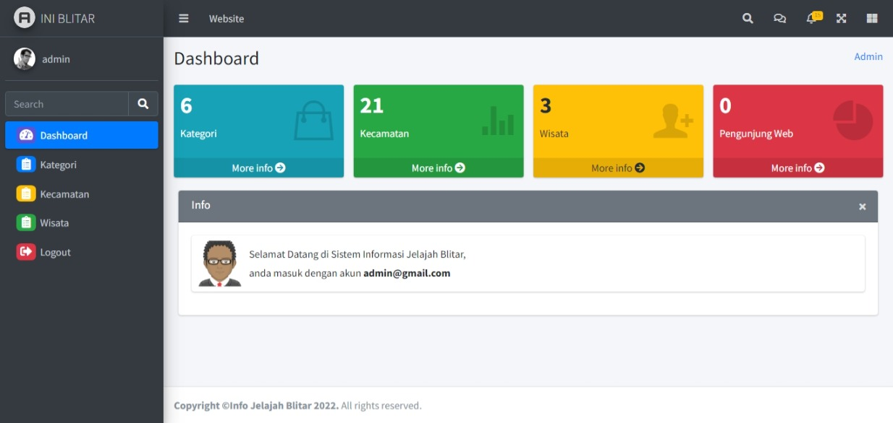

## Sistem Informasi Jelajah Blitar

## Admin Dashboard

##

Sistem Informasi Jelajah Blitar adalah sebuah platform atau sistem informasi yang dirancang untuk membantu pengguna menjelajahi dan mendapatkan informasi tentang tempat-tempat menarik, wisata, fasilitas, acara, dan informasi terkait Blitar, sebuah kota di Jawa Timur, Indonesia. Sistem informasi ini bertujuan untuk mempermudah pengguna dalam merencanakan perjalanan mereka, menjelajahi tempat-tempat menarik, dan mendapatkan informasi terkait wisata di Blitar. Berikut adalah penjelasan lebih lanjut tentang sistem informasi jelajah Blitar:

<b>Informasi Lokasi:</b> Sistem informasi ini menyediakan informasi tentang lokasi-lokasi wisata, restauran, caffee, dan fasilitas umum penting di Blitar. Pengguna dapat mengetahui alamat dan deskripsi singkat mengenai setiap lokasi ini.

<b>Peta Interaktif:</b> Sistem ini dilengkapi dengan link google map yang mempermudah pengguna untuk melihat lokasi wisata tersebut.

<b>Fitur Pencarian:</b> Terdapat fitur pencarian yang memungkinkan pengguna untuk mencari nama atau informasi tertentu dengan cepat. Misalnya, pengguna dapat mencari restoran tertentu atau nama wisata berdasarkan kriteria tertentu.

Sistem Informasi Jelajah Blitar memiliki tujuan untuk memberikan pengalaman yang lebih baik bagi wisatawan dan penduduk setempat, dengan memberikan akses mudah ke informasi yang relevan dan terbaru tentang Blitar. Dengan demikian, pengguna dapat merencanakan perjalanan mereka dengan lebih efisien dan menikmati semua yang Blitar tawarkan.
